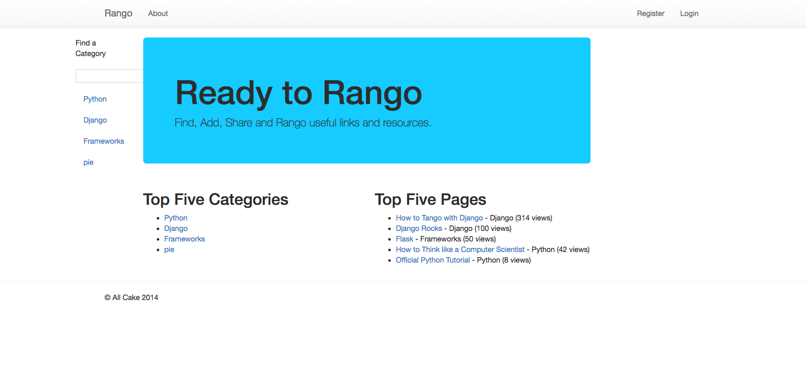

Tango_With_Django
=================

## Introduction

The source code for the Tango with Django project. This application allows users to share and like links. They are sorted by category.

## Installation instructions

To run this application, install `Python 2`, `virtualenv`, and `virtualenvwrapper`.

After you have created the virtualenv (`mkvirtualenv tango-with-django --python=python2`), run `python manage.py runserver`.